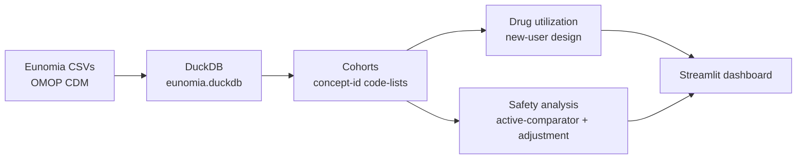

# Real-World Evidence Pipeline — NSAID Utilization & GI-Bleed Safety (OMOP CDM)

> A descriptive **real-world evidence (RWE)** pipeline on **OMOP**-standardized synthetic patient data:
> build patient cohorts, analyze drug utilization, and run a properly-designed drug-safety analysis —
> surfaced in an interactive Streamlit dashboard.

**🔗 Live dashboard:** https://rwe-omop-pipeline-b7bmnfx4uicppdwharuxfb.streamlit.app/

---

## What this is (and why it matters)

Clinical data lives in two worlds. **Clinical trials** (CDISC SDTM/ADaM) are small, clean, pre-approval.
**Real-world data** — insurance claims and electronic health records — is large, messy, and post-approval,
standardized to the **OMOP Common Data Model (CDM)** so one analysis can run across many databases.

This project works in the *second* world: it takes OMOP-standardized real-world data and answers a classic
post-market pharmacovigilance question — **do NSAID painkillers raise the risk of gastrointestinal bleeding?**

## Data

- **OHDSI Eunomia (GiBleed)** — ~2,700 **synthetic** patients in **OMOP CDM v5.3**.
- Source: <https://github.com/OHDSI/EunomiaDatasets>
- Synthetic data → no privacy constraints, but distributions are **not** real epidemiology. The numbers
  validate the *method*, not clinical reality.

## Pipeline



## Headline result — why unadjusted RWE misleads

| Estimate | Value | 95% CI | Reads as |
|---|---|---|---|
| **Crude risk ratio** | 0.49 | 0.43–0.57 | NSAIDs *protective* (implausible) |
| **Age/sex-adjusted odds ratio** | 0.98 | 0.78–1.24 | **No effect** (CI crosses 1) |

The crude comparison suggested NSAIDs *halve* bleed risk — the opposite of established medicine. After
adjusting for age and sex, the effect **vanished**. A textbook demonstration of **confounding**: naive
real-world comparisons mislead, which is why rigorous designs exist.

## Design & methods

- **Cohorts** defined by curated **concept-id code-lists** (drugs: ibuprofen/naproxen/acetaminophen/…;
  outcome = GI bleed: Peptic ulcer `4027663` + GI hemorrhage `192671`).
- **New-user design** — patients enter at first exposure (index date).
- **Utilization** — prescriptions per patient, course length (`days_supply`), switching, concomitant meds.
- **Safety** — new-user **active-comparator** (NSAID vs acetaminophen-only), incident outcome after index,
  prevalent cases excluded, **age/sex-adjusted logistic regression** with 95% confidence intervals.

## Tech stack

Python · **DuckDB** (analytics database) · pandas · **statsmodels** (logistic regression) ·
**Streamlit** + **Altair** (dashboard). All free; no cloud beyond Streamlit Community Cloud.

## Repository

```
rwe-omop-pipeline/
├── src/            # numbered analysis scripts (download, load, cohorts, utilization, safety) + analysis.py
├── app/app.py      # Streamlit dashboard
├── docs/           # OMOP glossary
├── data/           # eunomia.duckdb (committed for the live demo)
├── requirements.txt
└── learning_log_omop.md
```

## Run it locally

```bash
git clone https://github.com/verswijveldavid-ops/rwe-omop-pipeline.git
cd rwe-omop-pipeline
python3 -m venv .venv && source .venv/bin/activate
pip install -r requirements.txt
streamlit run app/app.py            # DB is included; boots immediately
```

To rebuild the database from source instead: `python src/01_download_eunomia.py && python src/02_load_to_duckdb.py`.

## Limitations

- Synthetic data likely encodes no true NSAID→bleed effect.
- Residual confounding (no adjustment for aspirin co-use, comorbidity, health-seeking behaviour).
- Follow-up not matched on person-time; single database.

## Future enhancements

Drug eras for continuous-exposure windows · propensity-score matching · person-time incidence rates ·
scale-up to OHDSI SynPUF · dbt for the transform layer.

---

*Portfolio project. Synthetic data only; no real patient information. Numbers demonstrate methodology, not clinical findings.*
