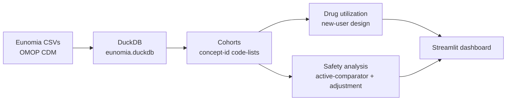

# Real-World Evidence Pipeline — NSAID Utilization & GI-Bleed Safety (OMOP CDM)

**Do painkillers like ibuprofen raise the risk of gastrointestinal bleeding — and what does a naive analysis get wrong?**

A descriptive **real-world evidence (RWE)** pipeline on **OMOP**-standardised patient data: build cohorts, analyse drug utilisation, run a properly-designed drug-safety analysis, and surface it in a Streamlit dashboard.

**Short answer:** A crude comparison suggested NSAIDs **halve** the risk of GI bleeding (risk ratio 0.49) — implausibly protective and the opposite of established medicine. After adjusting for age and sex, the effect **vanished** (odds ratio 0.98). A textbook demonstration of why naive real-world analyses mislead.

**🔗 Live dashboard:** https://rwe-omop-pipeline-b7bmnfx4uicppdwharuxfb.streamlit.app/

---

## About the data — an important note

This project uses **OHDSI Eunomia (GiBleed)**, the **official training dataset** published by OHDSI (Observational Health Data Sciences and Informatics) for demonstrating OMOP CDM workflows. It's ~2,700 **synthetic** patients in OMOP CDM v5.3 — the exact structure used by real hospitals and insurers worldwide for observational research. This is what pharma RWE teams learn OMOP on.

For projects on **real** patient data, see:
- [dietary-oncology](https://github.com/verswijveldavid-ops/dietary-oncology) — real NHANES survey data on ~10,000 US adults
- [oncology-survival-pipeline](https://github.com/verswijveldavid-ops/oncology-survival-pipeline) — real TCGA breast cancer data

---

## Why this project exists

Clinical data lives in two worlds.

- **Clinical trials** (CDISC SDTM/ADaM) are small, clean, pre-approval. See my [clinical-data-pipeline](https://github.com/verswijveldavid-ops/clinical-data-pipeline) project for that side.
- **Real-world data** — insurance claims and electronic health records — is large, messy, and post-approval, standardised to the **OMOP Common Data Model (CDM)** so one analysis can run across many databases.

This project works in the **second** world: it takes OMOP-standardised data and answers a classic post-market pharmacovigilance question.

---

## The data

- **Source:** [OHDSI Eunomia GiBleed](https://github.com/OHDSI/EunomiaDatasets) — the official OMOP training dataset.
- **Cohort:** 2,694 synthetic patients, 67,707 drug exposures, 1,281 GI-bleed condition records.
- **Format:** OMOP CDM v5.3 (person, drug_exposure, condition_occurrence, concept…).
- Synthetic data → no privacy constraints, but distributions are **not** real epidemiology. Numbers demonstrate the **method**, not clinical reality.

---

## Method



- **Cohorts** defined by curated **concept-id code-lists** — drugs: ibuprofen, naproxen, acetaminophen. Outcome: GI bleed = Peptic ulcer (concept 4027663) + GI haemorrhage (192671).
- **New-user design** — patients enter the cohort at their first exposure to the drug (the index date). This avoids the classic bias of comparing long-time users to new users.
- **Active comparator** — NSAID new-users vs acetaminophen-only new-users. Comparing "took a painkiller" against "took a different painkiller" is fairer than comparing "took a drug" against "took nothing."
- **Utilization** — prescriptions per patient, course length (days_supply), switching, concomitant meds.
- **Safety** — incident (not prevalent) GI bleeds after the index date, age- and sex-adjusted logistic regression with 95% confidence intervals.

---

## Findings

### 1. The headline — naive analysis is wrong

| Estimate | Value | 95% CI | Reads as |
|---|---|---|---|
| **Crude risk ratio** | **0.49** | 0.43–0.57 | NSAIDs *halve* bleed risk (implausible) |
| **Age + sex-adjusted odds ratio** | **0.98** | 0.78–1.24 | **No effect** — CI crosses 1 |

The crude number suggests NSAIDs are strongly protective. That's the opposite of established medicine. Adjusting for age and sex — patients on NSAIDs skew younger and healthier than acetaminophen-only users — makes the effect disappear.

### 2. The active-comparator cohorts

| Group | N (new users) | Incident GI bleeds | Crude risk |
|---|---|---|---|
| NSAID (ibuprofen or naproxen) | 1,486 | 285 | 19.2% |
| Acetaminophen only | 779 | 303 | 38.9% |

Notice that acetaminophen users have a much higher bleed rate — which is why the naive comparison makes NSAIDs look protective. Age and sex explain that difference.

### 3. Why this matters for real work

Every large observational RWE analysis has to survive this exact test: does the effect hold when you adjust for confounders? Sponsors, regulators, and payers ask this every time. The **collapse from RR 0.49 → OR 0.98** is a textbook example of **confounding by indication** — one of the reasons observational studies alone are rarely enough for a causal claim, and why methods like propensity-score matching and active-comparator designs exist.

---

## Honest limits

- **Synthetic data** likely encodes no true NSAID→bleed effect, so the "null after adjustment" is expected and the exercise is methodological.
- **Only age and sex adjusted** — a real analysis would also handle aspirin co-use, comorbidities, health-seeking behaviour, calendar year.
- **No person-time analysis** — follow-up is treated as fixed, not as time-at-risk.
- **Single database** — real RWE runs the same analysis across many OMOP databases and checks agreement.

## Future work

- Propensity-score matching on the active-comparator cohort.
- Person-time incidence rates and Kaplan-Meier curves for time-to-event.
- Scale-up to the OHDSI SynPUF (real Medicare claims restructured as OMOP) — an order of magnitude larger.
- dbt for the transform layer.

---

## Tech stack

**Python** · **DuckDB** (analytics database, one file) · **pandas** · **statsmodels** (logistic regression) · **Streamlit** + **Altair** (dashboard). All free; no cloud beyond Streamlit Community Cloud.

## Repository

```
rwe-omop-pipeline/
├── src/           # numbered analysis scripts (download, load, cohorts, utilisation, safety)
├── app/app.py     # Streamlit dashboard
├── docs/          # OMOP glossary
├── data/          # eunomia.duckdb (committed for the live demo)
├── requirements.txt
└── learning_log_omop.md
```

## How to run

**View the dashboard only** (uses the committed DuckDB — boots immediately):

```bash
git clone https://github.com/verswijveldavid-ops/rwe-omop-pipeline.git
cd rwe-omop-pipeline
python3 -m venv .venv && source .venv/bin/activate
pip install -r requirements.txt
streamlit run app/app.py
```

**Rebuild the database + rerun the safety analysis from raw:**

```bash
python src/01_download_eunomia.py    # download Eunomia CSVs
python src/02_load_to_duckdb.py      # load into DuckDB
python src/12_comparative_safety.py  # headline crude vs adjusted result
streamlit run app/app.py
```

---

*Portfolio project. Synthetic data only; no real patient information. Numbers demonstrate methodology, not clinical findings.*
